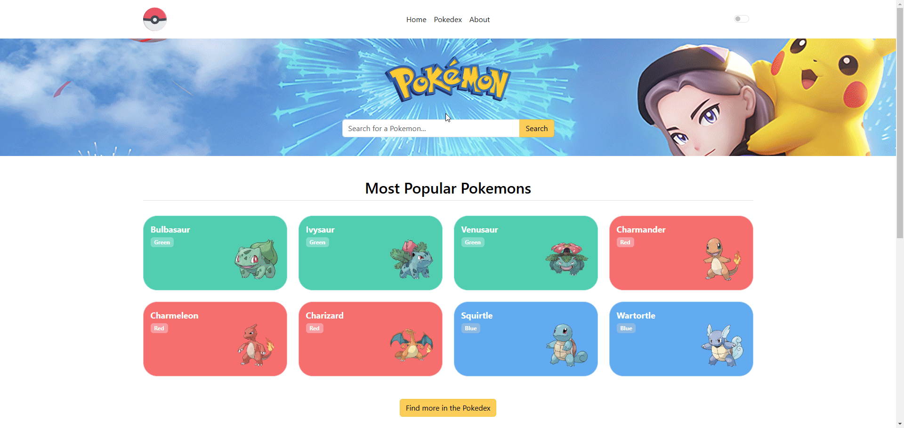

<h1 align="center" style="font-weight: bold;">Pokedex React</h1>

  <a href="#tech">Technologies</a> •
  <a href="#started">Getting Started</a>

    <b>My very first React application (Just the README has been added years later) - front end application that consumes the Poke API.
     
    Completely rewritten in NextJS - <a href="https://github.com/AndrejZaf/pokedex_next">Pokedex - NextJS.
</b> 

<h2 id="technologies">💻 Technologies</h2>

- 
- 
- 

<h2 id="started">🚀 Getting started</h2>
<h3>Prerequisites</h3>

- [Node.js](https://nodejs.org/en/download/package-manager) - **Node 16 is required**
- [TypeScript](https://www.npmjs.com/package/typescript)

<h3>Starting the Project</h3>

- Clone the project, install the node dependencies by running `npm install` and then you can start the application with
  `npm run start`.